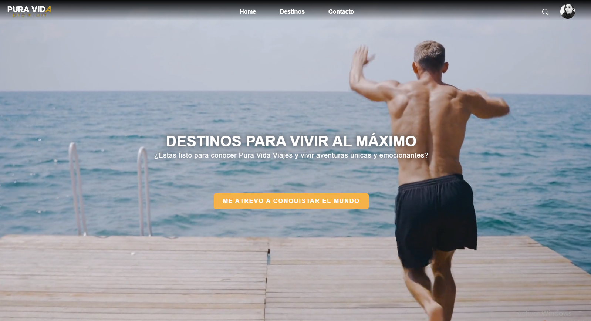
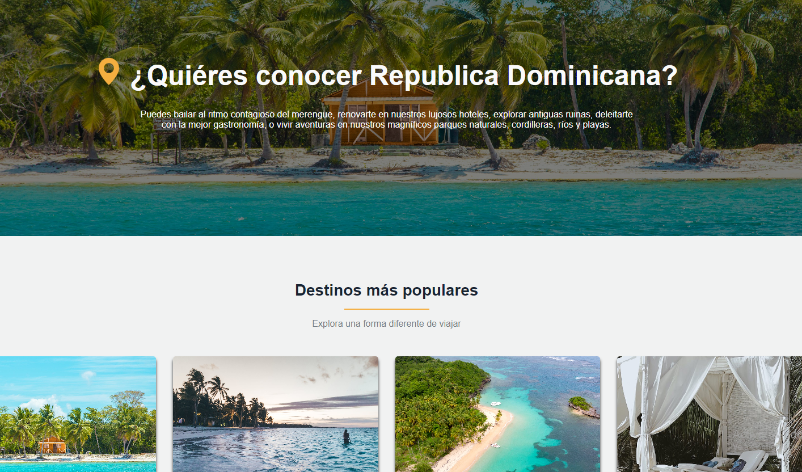
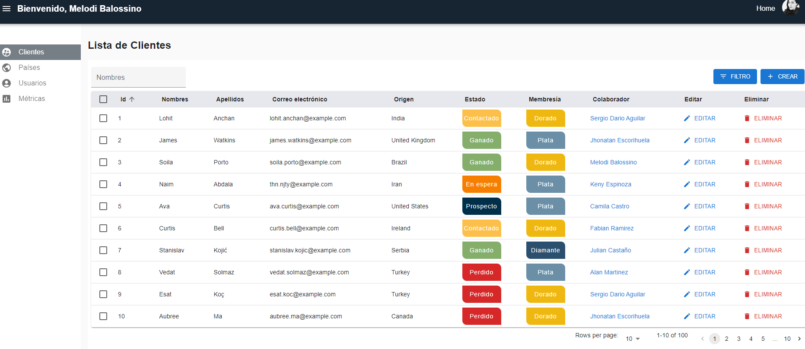
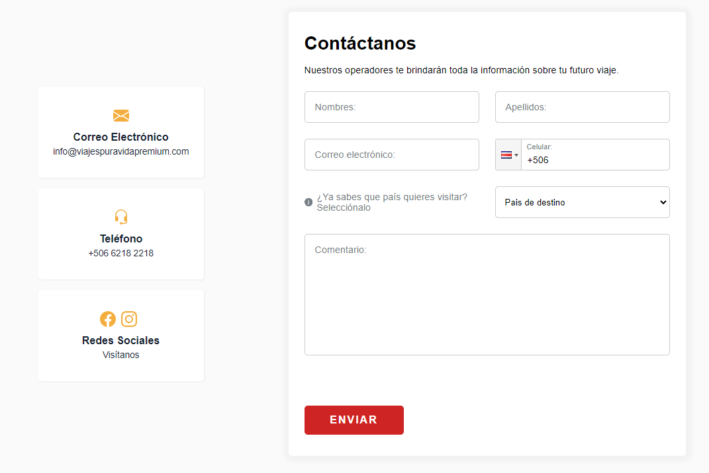

 
  
 
 
 
 
 
 

# **🗺️ MVP para la empresa Pura Vida Viajes**
 

## 🔗 Deploy:
https://client-puravidas-projects.vercel.app/
   

## 🔗 Demo en YouTube:
https://youtu.be/05tl_rTLVtc?si=bHiXhfitxw_CzRae
   

## 🛠️ Herramientas implementadas: 

**Front End:**
  - HTML5
  - CSS Modules
  - JavaScript
  - React - Vite
  - Redux toolkit
  - React-admin
  - Material UI
  - API Places Google
  - React Paginate
  - Sweeper y SweetAlert

  

**Back End:**
  - NodeJS
  - Express
  - Sequelize
  - Nodemailer
  - Auth0
  - Paypal

  

**DBMS:**
  - MySQL

  

**Gestión:**
  - Metologías ágiles - Scrum
  - Github flow
  - Trello
  - Slack
  - Discord

  

    

  

## 📧 Contacto:
¿Tienes un proyecto en mente o simplemente quieres charlar sobre tecnología? ¡Hablemos de cómo podemos ayudarnos mutuamente a crecer y a innovar!. Conectémonos y hagamos que las cosas sucedan! Puedes escribirme a rodrigoalanmartinez@gmail.com o seguirme en [LinkedIn] (https://www.linkedin.com/in/alanrmartinez/).

